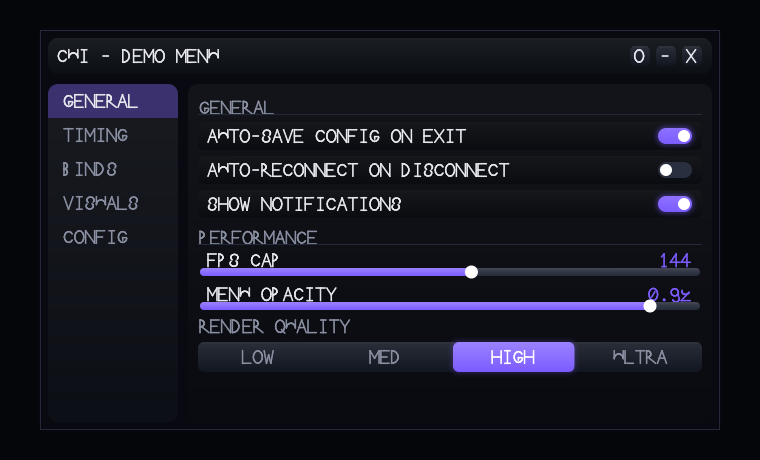

# cheatui

A small, dependency-free C++17 UI library for building themed overlay-style
menus: draggable window, tabbed sidebar with an animated selection bar and
crossfading tab content, glowing accents, soft bevel gradients, anti-aliased
shapes, a smooth vector font, swappable/cross-fading color themes, and a
save/load config system. No third-party libraries required.



It's renderer-agnostic. All drawing goes through a small `IRenderer`
interface, so you plug it into whatever you're already drawing with (D3D,
OpenGL, GDI, an existing ImGui draw list, whatever) and every widget,
animation, glow/bevel effect, and the config system works as-is. A CPU
software renderer (`Canvas`) ships with the library so the examples build
and run with zero setup, including headless - shapes are anti-aliased with
real sub-pixel coverage, not just hard-edged pixels.

New here? Read **[TUTORIAL.md](TUTORIAL.md)** for a full walkthrough. This
README covers the shape of the project and how to get it building.

## Widgets

- **Checkbox** - on/off switch with a sliding, glowing pill
- **Slider** - drag to pick a value, or click the value itself to type an exact number
- **Stepper** - small integer count with -/+ buttons
- **RadioGroup** - a few mutually exclusive options, shown side by side with a sliding selector
- **ComboBox** - dropdown list for longer option sets
- **ColorPicker** - saturation/value square + hue strip
- **Keybind** - click, then press a key to bind it
- **Button** - action button with a hover glow
- **Label** - section header

Every widget shares the same shape (an id, `Update`, `Render`,
`SaveTo`/`LoadFrom`), so adding a new one is a matter of writing one more
small class - see the bottom of TUTORIAL.md.

## Window chrome

The title bar supports a built-in **minimize** button (collapses the menu
down to just its title bar, animated), an opt-in **close** button (you
decide what closing means - hide, quit, save-then-quit), and any number of
**custom buttons** you add yourself (a pin, a settings gear, whatever).
The whole window also fades and slides in/out smoothly instead of
snapping when you show or hide it. See TUTORIAL.md section 7.

Title bar, sidebar, and content are each their own independent, fully
rounded floating panel with real gaps between them (`theme.windowMargin`,
`theme.sectionGap`) - not one flush block - so nothing needs corner-matching
against its neighbor and every panel is uniformly rounded, no square notches.

## The modern look

- **Real anti-aliasing** - `Canvas` computes sub-pixel coverage on every
  circle, rounded corner, and line instead of a hard inside/outside test,
  so edges are smooth at any size or angle.
- **A smooth vector font** - text is drawn as anti-aliased monoline strokes
  (`include/StrokeFont.hpp`), not a blocky bitmap, so labels and numbers
  read as clean lines rather than pixelated squares.
- **Glow** - a soft halo behind active toggles, hovered buttons, the
  selected tab, and the window border, built from a few translucent
  layered shapes (`cui::style::Glow`).
- **Bevel gradients** - panels and buttons use a subtle light-top,
  dark-bottom gradient plus a hairline top highlight instead of a flat
  fill (`cui::style::BeveledPanel`), which is what makes toggles, sliders,
  and buttons read as slightly raised/glassy rather than flat rectangles.
- **Swappable, cross-fading themes** - `include/Themes.hpp` ships a handful
  of ready-made palettes; `menu.SetTheme(cui::themes::Crimson())` blends
  every color from the current theme to the new one instead of snapping.

`theme.glowStrength`, `theme.bevelStrength`, and `theme.textScale` are all
adjustable if you want a flatter, punchier, or differently-sized look.

## Project layout

```
include/           every public header (this is what you copy into your project)
  cheatui.hpp         single include that pulls in the whole public API
  Color.hpp           RGBA color, HSV conversion, lerp
  Easing.hpp          easing curves used by the animation system
  Animation.hpp       AnimatedFloat / AnimatedColor / HueCycler / Oscillator - fade/slide/pulse primitives
  Renderer.hpp         IRenderer - implement this once per graphics backend
  Style.hpp             Glow / BeveledPanel helpers, built only on IRenderer
  Theme.hpp             color palette + spacing + glow/bevel/text scale, all in one struct
  Themes.hpp             ready-made theme presets (Midnight, Crimson, Emerald, Ocean, Sunset...)
  Input.hpp              per-frame mouse/keyboard snapshot (mouse, keys, and typed text)
  Config.hpp               typed key/value store with .cfg file I/O
  Widgets.hpp                 every widget class
  Tab.hpp                        a page of widgets
  Menu.hpp                          the window itself (chrome buttons, tabs, fade in/out)
  Canvas.hpp                        reference CPU-rendered IRenderer implementation
  StrokeFont.hpp                     vector font data used by Canvas
src/                implementations for the headers above that need one
examples/
  getting_started.cpp    the short walkthrough from TUTORIAL.md, runnable
  demo.cpp                bigger 5-tab showcase exercising every widget + window chrome + themes
tools/
  raw_to_png.py            converts Canvas's .raw frame dumps into real PNGs
```

## Building

Needs nothing but a C++17 compiler. Two options:

**Just compile it directly:**
```sh
g++ -std=c++17 -O2 -Iinclude src/*.cpp examples/getting_started.cpp -o getting_started
./getting_started
```

**Or with CMake:**
```sh
cmake -S . -B build
cmake --build build
./build/cheatui_getting_started
./build/cheatui_demo
```

Both examples write `.raw` frame dumps to `out/` (there's no window system
in a console program, so they render into an in-memory canvas and save
it). View one with:
```sh
python3 tools/raw_to_png.py out/getting_started.raw out/getting_started.png
```

## Using it in your own project

Copy `include/` and `src/` into your project (or `add_subdirectory()` it
if you're using CMake - see TUTORIAL.md section 1), then:

```cpp
#include "cheatui.hpp"

cui::Menu menu("My App", cui::Rect{60, 60, 520, 360});
cui::Tab& main = menu.AddTab("Main");
main.Add<cui::Checkbox>("main.enabled", "Enable feature", true);

// your loop:
menu.Update(inputSnapshot, deltaTime);
menu.Render(yourRenderer);
```

Full details, every widget type, config profiles, and theming are in
**[TUTORIAL.md](TUTORIAL.md)**.

## Putting this on GitHub

If you want your own copy of this hosted on GitHub so others can clone or
submodule it:

```sh
cd cheatui
git init
git add .
git commit -m "initial commit"
git branch -M main
git remote add origin https://github.com/yourname/cheatui.git
git push -u origin main
```

A GitHub Actions workflow is already included at
`.github/workflows/build.yml` - it builds the library and both examples
on every push and pull request, so anyone opening a PR gets an automatic
build check. Nothing else to configure; GitHub picks it up as soon as the
`.github/workflows/` folder is pushed.

If your repo is going to be used by other projects via CMake, tag
releases (`git tag v1.0.0 && git push --tags`) so consumers can pin to a
specific version instead of tracking `main`.

## Notes

- Text rendering uses a small monoline vector font (`StrokeFont.hpp`) built
  for this project so the examples have zero font-file dependencies -
  strokes are drawn with the same anti-aliased `Line()` calls as everything
  else, so text stays smooth at any scale (`theme.textScale`). Swap
  `Canvas::Text` for your platform's real text API in a production backend
  for proper kerning and full Unicode support.
- The library is UI only - layout, input handling, animation, theming,
  config persistence. There's no automation, memory access, or networking
  anywhere in it. What a "Checkbox" or "Auto X" toggle *does* when it's on
  is entirely up to the application reading `.Value()`.
- MIT licensed - see `LICENSE`.
